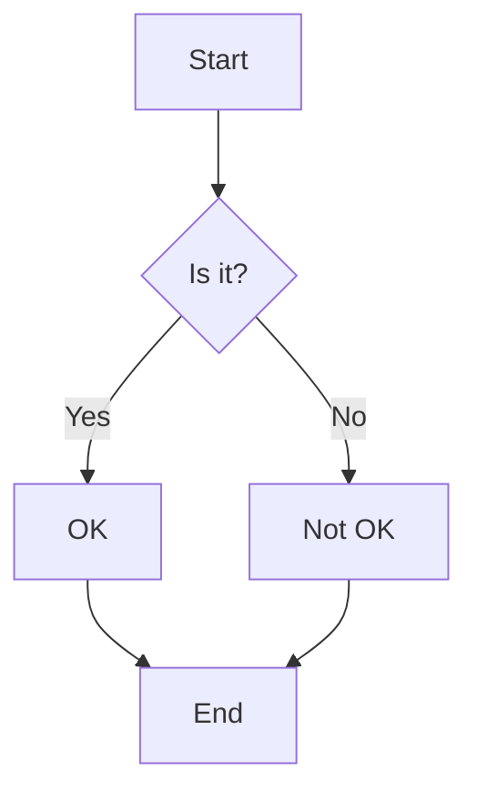
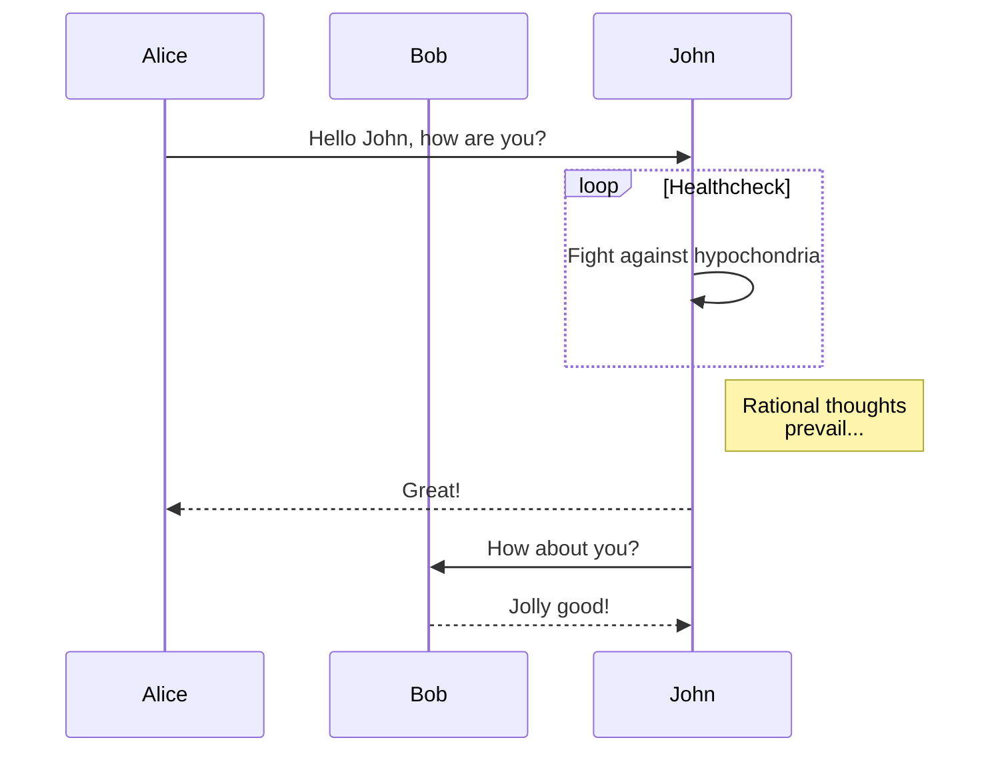
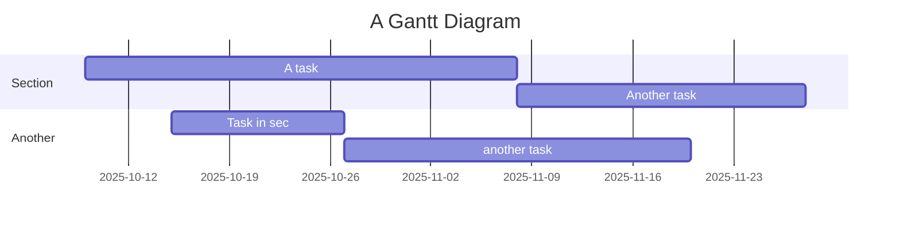

# My First Blog Post

Welcome to my blog! This is a sample post demonstrating the Markdown renderer.

## Features

- **Rich Text Formatting**: *Italic*, **bold**, and `inline code`
- Code blocks with syntax highlighting
- Images with captions
- Tables
- Blockquotes
- Lists
  - Nested lists
  - With different bullet points
    - Multiple levels deep
- Checkboxes
  - [x] Completed task
  - [ ] Pending task
  - [ ] Another task
- Mermaid Diagrams
  - Flowcharts
  - Sequence diagrams
  - Gantt charts
- Math (LaTeX)
  - Inline: $E = mc^2$
  - Display mode: $$\sum_{i=1}^{n} i = \frac{n(n+1)}{2}$$

### Code Example JavaScript

```javascript
function greet(name) {
  return `Hello, ${name}!`;
}

console.log(greet('World'));
```


### Code Example C++
```cpp
int main() {
    return 0;
}
```

## Mermaid Diagrams

### Flowchart


### Sequence Diagram


### Gantt Chart


### Math Examples

#### Inline Math
This is an inline equation: $\sqrt{16} = 4$ and $E = mc^2$.
   - Subitem 2
     - Sub-subitem A
     - Sub-subitem B
2. Second item
   - Another subitem

### Task List
- [x] Write the press release
- [ ] Update the website
  - [ ] Update the homepage
  - [ ] Update the about page
- [ ] Contact the media

### Mixed List
1. First item
   - Task 1 [ ]
   - Task 2 [x]
2. Second item
   - [ ] Task A
   - [ ] Task B

## Sample Data Table

Here's an example of a markdown table:

| Feature | Description | Status |
|---------|-------------|--------|
| Dark Mode | Toggle between light and dark themes | ✅ Implemented |
| Code Blocks | Syntax highlighting for code snippets | ✅ Implemented |
| Tables | Display tabular data | ✅ Implemented |
| Images | Support for embedded images | ✅ Implemented |
| Image Carousel | Support for image carousels | ✅ Implemented |
| Comments | User comments section | ✅ Implemented |

### Table Features

- **Responsive**: Adapts to different screen sizes
- **Sortable**: Click on column headers to sort
- **Accessible**: Properly structured for screen readers
- **Styling**: Consistent with your site's theme

## Heading 2

shivers

## A HREF Example
This is a example of <a href="https://www.google.com">Google</a> underlining <--

### Heading 3

shivers

#### Heading 4

shivers

##### Heading 5

shivers

###### Heading 6

shivers

## Reset Heading 1

asdfsdf


## Sample Image

Here's an example of an embedded image with a caption:


## Sample Image Gallery


<imagegallery 
  title="My Photo Collection" 
  images='[
    {
      "src": "https://placehold.co/600x400",
      "alt": "Beautiful landscape",
      "caption": "A stunning view of nature"
    },
    {
      "src": "https://placehold.co/600x400",
      "alt": "City skyline",
      "caption": "Urban architecture at night"
    }
  ]' 
/>